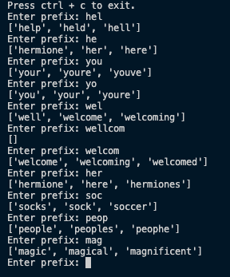
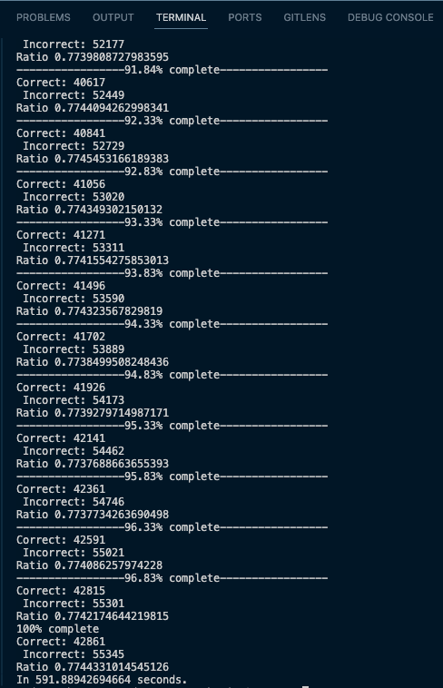

# ML-autocomplete

Machine Learning autocompletion

<p align="left" style="border: 5px solid #555">
  
</p>

### Theory

Our goal is to produce smart autocompletions for a word given its prefix characters.

This can be easily done for prefixes that are close to the length of the word. E.g. $autocomplet$ is clearly $autocomplete$. However, for less characters, the task becomes harder and harder. E.g. $we...$ as $weltanschauung$ (who would've known?)

The probability of a given word being the word the user is trying to spell is given as the probability of the next $i$ to $n$ letters given the previous $0$ to $i-1$ letters.

$$
P(w) = P(l_{i:n}|l_{0:i-1}))
$$

With this in mind, we can work out the probabilities of the next $x$ characters given a corpus of words where some word contains our prefix so far. E.g. we have the prefix $her$ and wish to complete it. Given our corpus contains

```python
{
	"here" : 564, 
	"hero" : 545,
	"heros" : 231,
	"hermit" : 6,
	...
}
```

we can determine the best $n$ words for our prefix - the best being $here$. However, you might be suprised to find that the actual best words the model predicts...

```bash
Enter prefix: he
['hermione', 'her', 'here']
```

### Tests

Testing for this is somewhat straight forward. However, it is necessary to create a heuristic for testing. That being, the number $n$ of letters we use as a prefix to guess the rest of the word. For simplicity's sake, I've choosen this as a floor division by 2 (`//2`). I believe this works fine for this test. In the future, it would be nice to test this on all prefix lengths (perhaps except for 0-2 characters as this would simpily not provide enough information.)

The first iteration of tests utilised 20% of the 'harryPotter.txt' corpus and achieved a $77.4$% accuracy. Additionally, the tests ran in 592 seconds for 100,975 words, giving the model a speed of `0.00586 seconds/word or 5.86 milliseconds/word` (Mac M1 2020 - with a few apps open.) 

<p align="left" style="border: 5px solid #555">
  
</p>

### Limitations

The model is very limited by the size and the type of the corpus. The model can predict very well in test cases because it is from the same corpus. Perhaps it would be a good idea to cross-reference corpora.

# Plan

### Goal

Create a machine learning algorithm that will autocomplete input words given a corpous of text.

### Components

* Corpus - local copy of large text sample
* Tokenizer - storing tokens
* App.py - main functions for autocompletion
* Tests.py - Used to test accuracy (Precision, Recall, F1, etc)

### Corpus

Plan to use compilation of books. Books provide a good source as they often contain a large variety in vocabulary. The weakpoint of this model will be the variety of text it is trained on.

### Tokenizer

The tokenizer can be seen as an abstract model which is provided with a number of preprocessed words (tokens.) The words will be stored in working memory. This will speed up look-up times for the autocompletion.

Words can be stored using their values but can be looked up using their prefix. For example, 'museum' can be stored and returned as part of a vector of matches for the prefix 'mus.' This implementation will have to be well thought out; some data structures will not be appropriate: hashmap, queue, etc.

A possible implementation could be a simple ordered vector, utilising a divide and conquor search algorithm, then returning the next n-number of words with the same starting prefix.

### App.py

App.py will handle the front-end implementation of the autocorrection model. Given a specific prefix, app.py will return a number of potential endings, with the following constraints: it will only return the 'best' 3 words and the words will be ordered by their probabilites.

The next step for App.py will be to dynamic autocorretion, e.g autocorrect suggestions while typing. This would allow a user to type the start of the word and enter more characters to retrieve more precise suggestions.

### Tests.py

Like with any good ML model, tests are an essential part of the evaluation process. A typical split, which I will be using, is 20:80. Meaning 20% of my corpous will be for testing the model which will be trained on the other 80%.

A good model should be able to correctly predict the ending of a word given a number of characters. The number of characters can vary by test, a single character would not be enough information to make an accurate guess.

**My goal for this model to have an accuracy of over 80% given a softmax on its predicted endings.**
